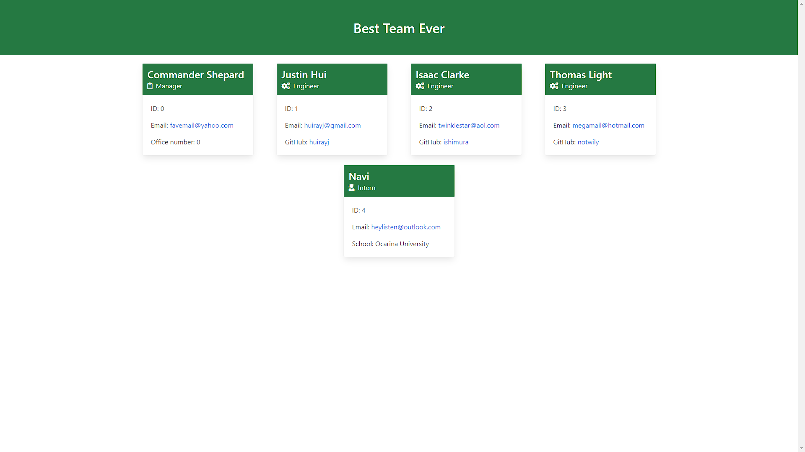

# Team Profile Generator via CLI

## Overview

In this exercise, the user creates a set of tests for several classes and cards that provide information taken from the user prompt in a HTML document.

## Table of Contents

  - [Table of Contents](#table-of-contents)
  - [Pseudocode](#pseudocode)
  - [Installation](#installation)
  - [Usage](#usage)
  - [Technologies Used](#technologies-used)
  - [Resources](#resources)
  - [Links](#links)
  - [Demo](#demo)
  - [Screenshots](#screenshots)
    - [Desktop](#desktop)
    - [Mobile](#mobile)

## Pseudocode

1. Write tests for each class.
2. Create classes for each role and run said tests.
3. Create a prompt that takes in user input.
4. Allow the user the option to add more team members or exit the prompt and generate the HTML document.
5. Create an array for the team members to be used as an argument in the given script 'htmlRenderer.js'

## Installation

1. `npm init`
2. `npm i jest`
3. `npm i inquirer`

## Usage

- `npm test` to run tests.
- `node index.js` to run the app.

## Technologies Used

- JavaScript
- Node.js
- Jest
- Bulma CSS Framework

## Resources

- [npm](https://www.npmjs.com/)
- [Inquirer](https://www.npmjs.com/package/inquirer)
- [Jest](https://jestjs.io/docs/getting-started)
- [OOP](https://developer.mozilla.org/en-US/docs/Learn/JavaScript/Objects/Object-oriented_JS)
- [Classes](https://developer.mozilla.org/en-US/docs/Web/JavaScript/Reference/Classes)

## Links

- [Repository](https://github.com/huirayj/team-profile-generator)
- [Higher Quality Demo](https://drive.google.com/file/d/1sTofoT5fhUTP_IXwJl6flOUtCWEBmYqY/view?usp=sharing)

## Demo

## Screenshots

### Desktop

### Mobile

